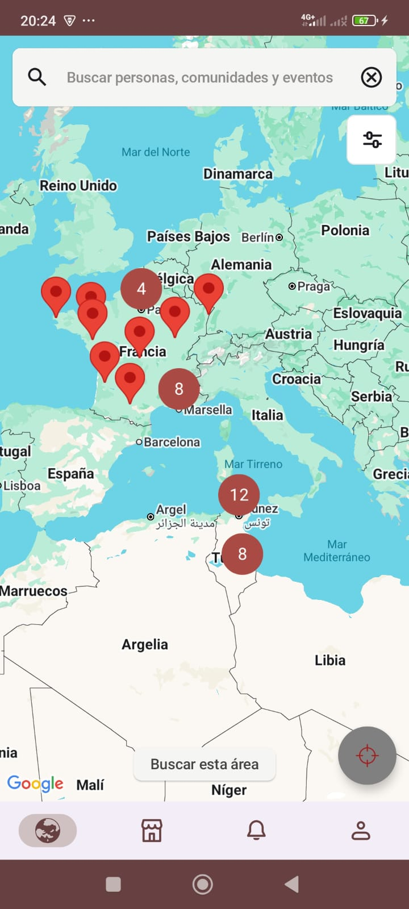
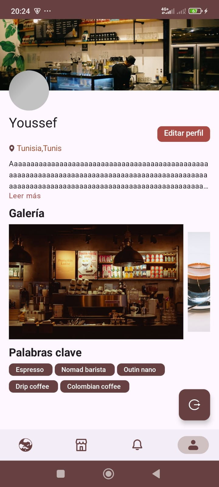
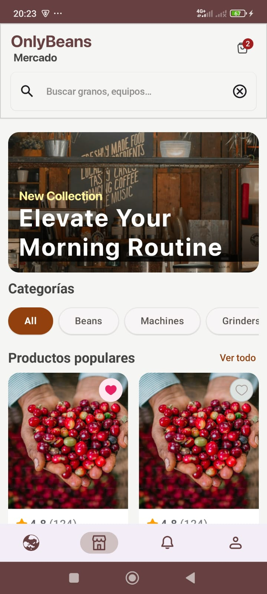
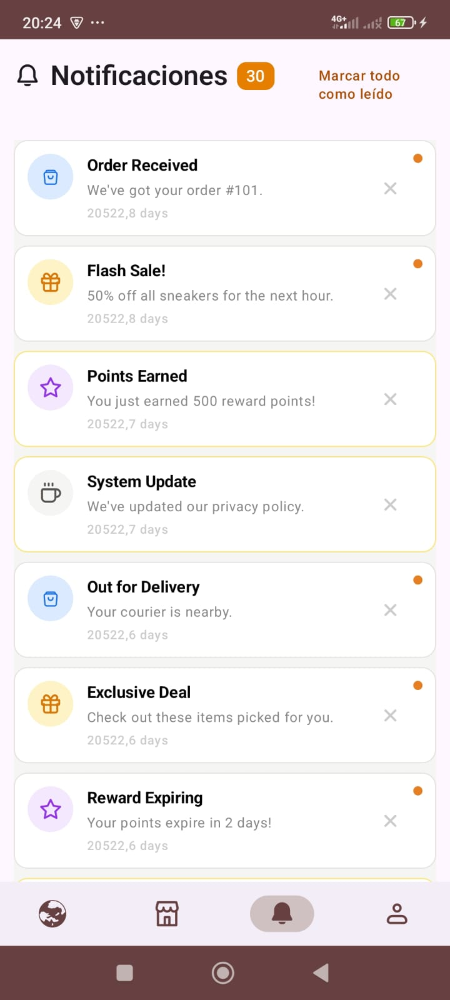

# OnlyBeans

*A mobile application that acts as a social platform for the coffee lovers community.

## Overview
Users can build their profile as Baristas,Roasters, etc and find other people with the same interest in coffee so that they can share content or even look for coffee shops, purchase coffee products or equipment from a global marketplace.

## Purpose
Why was this project created?
* **Motivation:** I'm a specialty coffee lover and this idea is motivating me to build a side project regardless of how useful it might be.
* **Goals:** The main goal is to build a side project to showcase my knowledge of modern android development.

## Main Features
* **Feature 1:** Login with email and password.
* **Feature 2:** Build your profile which includes your personal information and your coffee space. could be your coffee shop or even your home coffee corner.
* **Feature 3:** Search for users,coffee shops, farms, etc by arean on the map and based on filters that you set.
* **Feature 4:** Visit the marketplace to search and purchase products from different popular brands.
* **Feature 5:** Receive notifications about the latest trends, promotions and even your orders.

## Technical Description
This section highlights the technologies used in the codebase.

* **Language:** Kotlin 
* **UI:** Jetpack compose
* **Architecture:** MVVM / State Management with compose / Multi-module architecture
* **Dependency Injection:** Koin
* **Networking:** Ktor
* **Local Persistence:** SqlDelight/Preferences
* **Asynchronous:** Flows,Coroutines

## Extra Notes
* I started with KMP template and libraries but then i decided to switch to android-first development.
* This project was originally a different app idea with different features which i personally built for university project but fortunately it served as template for this new app.
* I'm still refactoring this project: Design system, DI, navigation essentially.
* **License:** GNU General Public License v3.0
